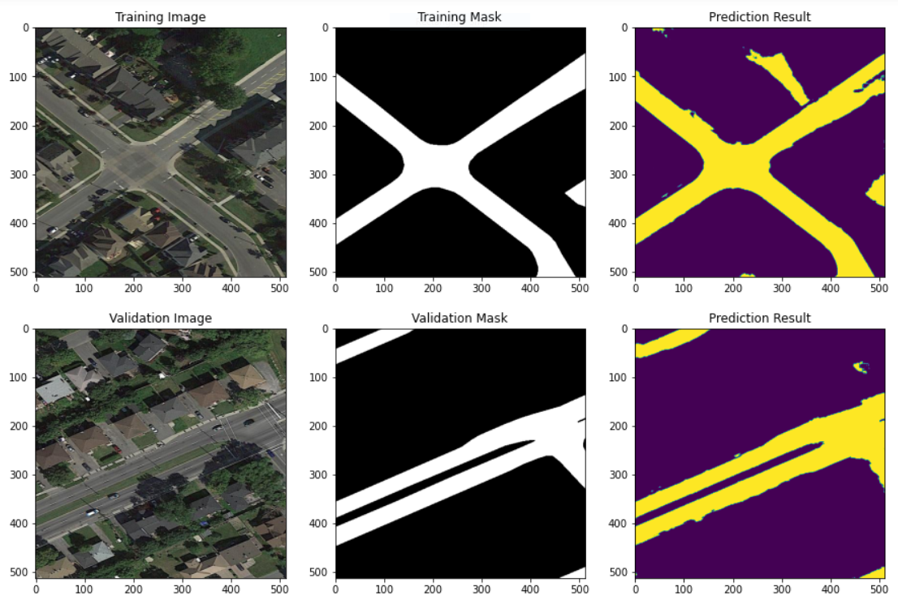
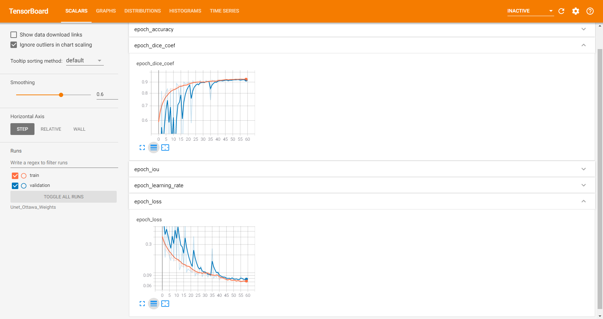

# Semantic segmentation of roads on satellite imagery using Unet in tf.keras

## This repo demonstrates a Unet TensorFlow implentation for binary segmentation of satellite imagery using the [Ottawa Road datset](https://github.com/yhlleo/RoadNet)

## Data preprocessing and network training and perfromed in Jupyter Notebooks:

> # Pre-Process-Ottawa-Data.ipynb
> # Unet-Training.ipynb

# Dependencies

- tensorflow-gpu 2.4.1
- tensorboard